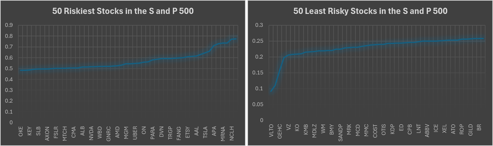
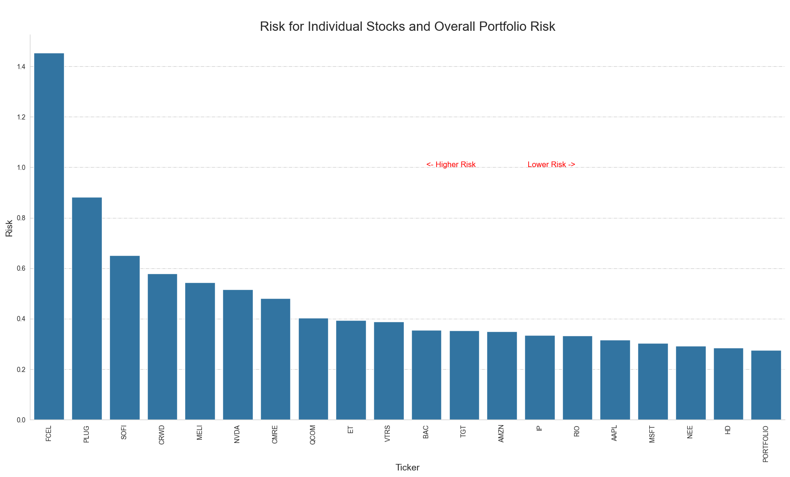

# Stock Market Risk Calculator

 

This program is designed to assess the risk associated with individual stocks and the overall portfolio by calculating 
key statistical measures such as variance, standard deviation, covariance, and weighted return. It utilizes historical 
stock data fetched from Yahoo Finance and performs quantitative risk analysis to inform investment decisions.

 

### Diversification is Key
Analyzing the S and P 500 risk using equal weighting, it shows the power of diversification. The S and P 500 index has a much lower risk than 
owning popular individual "Magnificent 7" stocks.

| Metric                       | Risk        |  
|------------------------------|-------------|
| S and P Overall Risk         | 0.224313377 |
| S and P Mean (all stocks)    | 0.341956448 |
| S and P Average (all stocks) | 0.354114634 |
| Nvidia (NVDA)                | 0.516539679 |
| Tesla (TSLA)                 | 0.644386800 |
| Meta Platforms  (META)       | 0.442057689 |

## Features

- **Ticker and Weight Extraction**: Reads a CSV file to create lists of stock tickers and their corresponding weights in the portfolio.
- **Historical Data Retrieval**: Fetches 5-year historical closing prices for each stock using Yahoo Finance.
- **Risk Calculation**:
  - Computes daily returns and generates a covariance matrix.
  - Calculates portfolio variance and standard deviation on a daily and annual basis.
  - Determines individual stock risks and aggregates them to evaluate overall portfolio risk.
- **Visualization**: Plots a bar chart to visually compare the risk levels of individual stocks and the portfolio.

## Usage

1. Input the portfolio details in `my_stocks.csv`. 
   - Note: columns need to be 'Ticker' and 'Value'
2. Run the program to generate `stock_prices.csv` and `risk_output.csv`.
3. View the plotted risk chart for a graphical representation of risk distribution.

## Dependencies

- yfinance
- pandas
- numpy
- seaborn
- matplotlib

Ensure these libraries are installed to run the program successfully.

## Output

The program outputs a CSV file containing the calculated risks for individual stocks and the portfolio, 
along with a bar chart visualizing the risk levels.



---

For detailed function descriptions and code usage, refer to the inline comments within the script.
```

